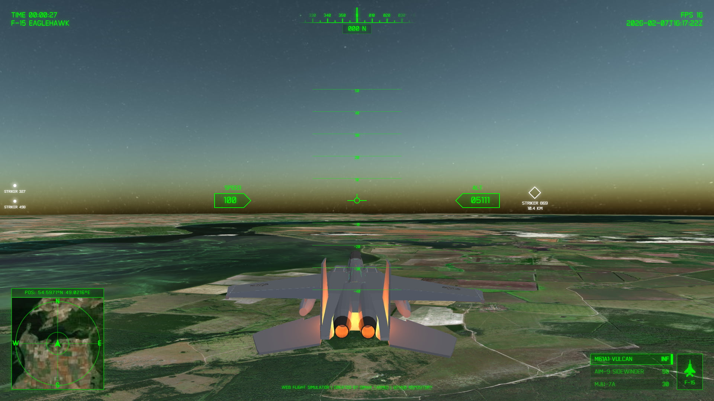

<p align="center">
  
</p>

# ✈️ Web Flight Simulator — Adaptation

[](https://developer.mozilla.org/en-US/docs/Web/HTML) [](https://developer.mozilla.org/en-US/docs/Web/CSS) [](https://developer.mozilla.org/en-US/docs/Web/JavaScript) [](https://threejs.org/) [](https://cesium.com/) [](https://vitejs.dev/)

> [!IMPORTANT]
> **Project origin:** This repository is an independently maintained adaptation of [Dimar Tarmizi's original Web Flight Simulator](https://github.com/dimartarmizi/web-flight-simulator). It is not the original upstream repository. The original simulator and its baseline architecture, code, UI, and bundled assets are credited to Dimar Tarmizi.

A browser-based flight simulator built with **Three.js** and **CesiumJS**. This adaptation keeps the upstream simulator's core experience while adding a documented set of geospatial, landing, telemetry, input, and configuration changes.



## 🔎 Attribution and Adaptation Scope

| Area | Status |
| :--- | :--- |
| **Original project** | [dimartarmizi/web-flight-simulator](https://github.com/dimartarmizi/web-flight-simulator) |
| **Original developer and copyright holder** | [Dimar Tarmizi](https://github.com/dimartarmizi) |
| **Adaptation maintainer** | [@cebrailbagatarhan](https://github.com/cebrailbagatarhan) |
| **This adaptation** | [cebrailbagatarhan/web-flight-simulator](https://github.com/cebrailbagatarhan/web-flight-simulator) |
| **License** | Upstream custom non-commercial license; see [LICENSE](LICENSE) |

### Changes in this adaptation

The following differences were verified against the upstream `main` branch when this README was updated:

- Moved Google Maps and Cesium ion configuration to Vite environment variables and added `.env.example`.
- Added optional Google Photorealistic 3D Tiles, with OpenStreetMap/ArcGIS imagery and OSM Buildings fallbacks.
- Added Turkey-focused spawn presets and an Antalya landing-success flow.
- Added persistent best score, radar altitude, vertical-speed, and flight-mode telemetry.
- Made throttle updates frame-rate independent and tightened direct weapon-selection handling.
- Added terrain-height sampling and loading-failure fallbacks for the expanded 3D flow.

These bullets describe this adaptation's changes; they are not a claim of authorship over the upstream simulator.

## 🚀 Key Features

### 🌍 Global Real-World Terrain
- **Digital Twin Earth**: Powered by CesiumJS, fly over high-resolution 3D topography and satellite imagery anywhere on the planet.
- **Dynamic Level-of-Detail**: Seamlessly transition from high-altitude stratospheric flight to low-level canyon runs.

### 🦅 Advanced Flight Combat & AI
- **F-15 Eaglehawk**: Optimized 3D model featuring dynamic afterburners and jet flame effects.
- **Weapon System**:
  - **M61A1 Vulcan**: High-speed internal cannon for close-range dogfights.
  - **AIM-9 Sidewinder**: Heat-seeking missiles with active target locking.
  - **MJU-7A Flares**: Advanced countermeasure system to evade incoming threats.
- **NPC Entities**: Encounter other aircraft in the world. AI flight behaviors and randomized callsigns are currently under development.

### 🖥️ Tactical HUD & UI
- **Professional Avionics**: A fully integrated Heads-Up Display (HUD) featuring:
  - Pitch Ladder and Heading Tape.
  - Real-time Altitude (ASL) and Airspeed (IAS) indicators.
  - Weapon Status and Ammo tracking.
  - Interactive Minimap with satellite navigation.

## ⚙️ Configuration & Options

The simulator allows customization of the flight experience through the in-game settings menu:

- **Graphics Quality**: Adjustable settings for performance tuning (rendering resolution and detail).
- **Antialiasing**: Enable/disable smoothing for jagged edges on the 3D model.
- **Fog Effects**: Toggle atmospheric fog for better immersion and depth perception.
- **Mouse Sensitivity**: Fine-tune the "Look Around" sensitivity for the tactical camera.
- **Sound Toggle**: Global master switch for all game audio.
- **Persistent Settings**: All choices are automatically saved to `localStorage` for future sessions.

## 🔊 Immersive Audio System

A complex sound environment is built using the `Three.js AudioListener` system:

- **Dynamic Engine Noises**: Realistic jet engine loops that react to throttle changes.
- **Wind & Aerodynamics**: Procedural wind sounds based on flight speed.
- **Tactical Warnings (GPWS/RWR)**:
  - **"PULL UP"**: Ground Proximity Warning System for terrain avoidance.
  - **Radar Warnings**: Distinct tones for target search (TWS) and active missile locks.
- **Combat SFX**: High-fidelity sounds for M61 Vulcan firing, missile launches, and randomized explosion variants.
- **Atmospheric UI**: Subtle button hovers, clicks, and screen glitch transitions for a modern tactical interface.

## ⌨️ Controls & Handling

| Category | Action | Key |
| :--- | :--- | :--- |
| **Flight** | Pitch Up / Down | `Arrow Down` / `Arrow Up` |
| | Roll Left / Right | `Arrow Left` / `Arrow Right` |
| | Yaw (Rudder) | `A` / `D` |
| | Increase / Decrease Throttle | `W` / `S` |
| | Afterburner (Boost) | `Space` |
| **Combat** | Fire Active Weapon | `Enter` or `F` |
| | Deploy Flares | `V` |
| | Select Weapon | `1` / `2` |
| | Cycle Weapon | `Q` |
| **View** | Look Around | `Mouse Left Drag` |

## 🛠️ Technical Overview

The project utilizes a **Hybrid Rendering Architecture**:
- **CesiumJS** handles the massive planetary scales, WGS84 coordinates, and terrain streaming.
- **Three.js** manages the local coordinate system for the aircraft model, particle effects (jet flames, explosions), and lighting.
- **Vite** provides an ultra-fast HMR development environment and optimized production builds.

## 📦 Installation & Setup

1. **Clone this adaptation:**
   ```bash
   git clone https://github.com/cebrailbagatarhan/web-flight-simulator.git
   cd web-flight-simulator
   ```

2. **Install dependencies:**
   ```bash
   npm install
   ```

3. **Create a local environment file:**
   ```bash
   cp .env.example .env
   ```

   On Windows Command Prompt, use `copy .env.example .env`.

4. **Add the API configuration needed by the services you use:**
   ```dotenv
   VITE_GOOGLE_MAPS_API_KEY=
   VITE_CESIUM_ION_TOKEN=
   ```

   The app falls back to non-key imagery when these values are unavailable. Variables prefixed with `VITE_` are included in the browser bundle, so restrict API keys by HTTP referrer, enabled APIs, and quota; do not treat them as server-side secrets.

5. **Run the development server:**
   ```bash
   npm run dev
   ```

6. **Build for production:**
   ```bash
   npm run build
   ```

## 📜 License

The upstream project and this adaptation are distributed under the custom non-commercial terms in [LICENSE](LICENSE):

- **Non-commercial use:** Permitted subject to the license terms.
- **Commercial use:** Requires a separate license from the original copyright holder.

For commercial licensing questions, contact the original copyright holder at [dimartarmizi@email.com](mailto:dimartarmizi@email.com).

## 🏷️ Credits

- **Original developer and copyright holder:** [Dimar Tarmizi](https://github.com/dimartarmizi)
- **Upstream repository:** [dimartarmizi/web-flight-simulator](https://github.com/dimartarmizi/web-flight-simulator)
- **Adaptation maintainer:** [@cebrailbagatarhan](https://github.com/cebrailbagatarhan)
- **3D model:** ["Low poly F-15"](https://sketchfab.com/3d-models/low-poly-f-15-0c1cfa22d7094556914fcdfba75bef5d) by [SIpriv](https://sketchfab.com/sipriv)
- **Engines:** [Three.js](https://threejs.org/) and [CesiumJS](https://cesium.com/)
